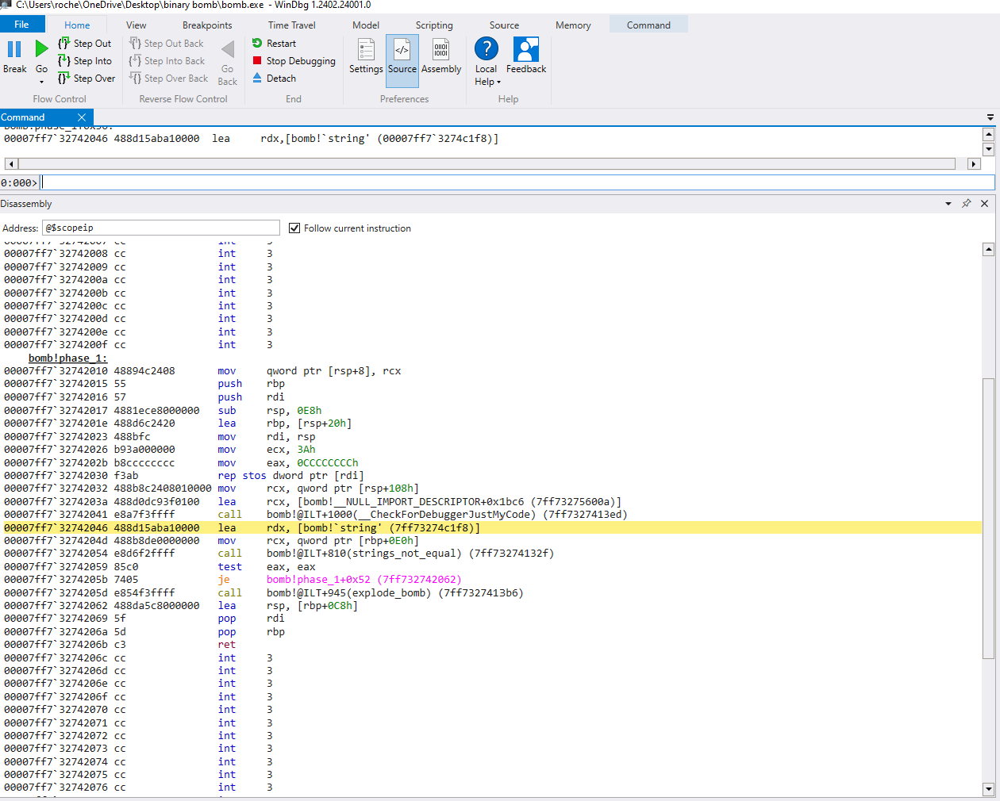

+++
title = "cmu binary bomb phase 1"
date = "2024-08-15T23:19:00-06:00"
draft = false
slug = "cmu-binary-bomb-phase-1"
categories = ["cmu-binary-bomb"]
featured_image = "img/computer.jpg"
+++
<!--more-->

Welcome to the beginning of the Binary Bomb lab walkthrough. I am going to give a comprehensive review of my strategy and through process when going through this challenge, but I am going to refrain from walking through *every* individual instruction.


When we run the binary bomb program, we are met with a message: "Welcome to my fiendish little bomb. You have 6 phases with which to blow yourself up. Have a nice day!"

_initial execution_

Well, let's give it some input and see what happens. 

_boom_

Our binary bomb has exploded. We need to investigate this and see what it is they want from us. Let's do some dynamic analysis using WinDbg and take a look at the main function. 


Initially this is alot to digest, but we can start to take step through the code while it executes to get an idea of what is happening. We see a few 'lea' instructions that seem to load our initial message pointers into registers, followed by a few calls to `printf()`. We can safely assume these are printing the welcome message we see. There is a call to `read_line()` which most likely taking the input we give. We also see a call to `phase_1()` followed by a call to `phase_defused()`. These two functions are of interest to us. Let's take a closer look at `phase_1()`


_phase 1 asm_

Thankfully, this seems to be a pretty small function. We see some initial stack setup code (alignment, storing callee-store registers, etc) along with a few function calls
- `strings_not_equal()`
- `explode_bomb()`

We're gonna go out on a limb and guess that `strings_not_equal()` takes in two strings, compares each byte, and returns if they are equal. This function is followed by a ``` test eax, eax ``` which performs a bitwise '&' operation on the register. The result is then used in ```je ... ```, which ultimately checks if the zero flag is set. If this flag is not set, the jump is not taken and the bomb explodes.

We can clearly see a ```lea rdx, 7ff73274c1f8```, followed by a ```mov rcx, qword ptr[rbp+0E0h]```. RCX and RDX are used for passing parameters in Windows compiler, so this is most likely our input and the expected string being loaded into memory. Let's take a look at these two memory locations and see if this is correct


There is the answer to phase_1 in plain text :0

**"I am just a renegade hockey mom."** seems to be like the input phase 1 is expecting. Let's give it a go


_phase 1 defused_


We can also see where we are in our `main()` function after successfully passing phase 1


On to phase 2!