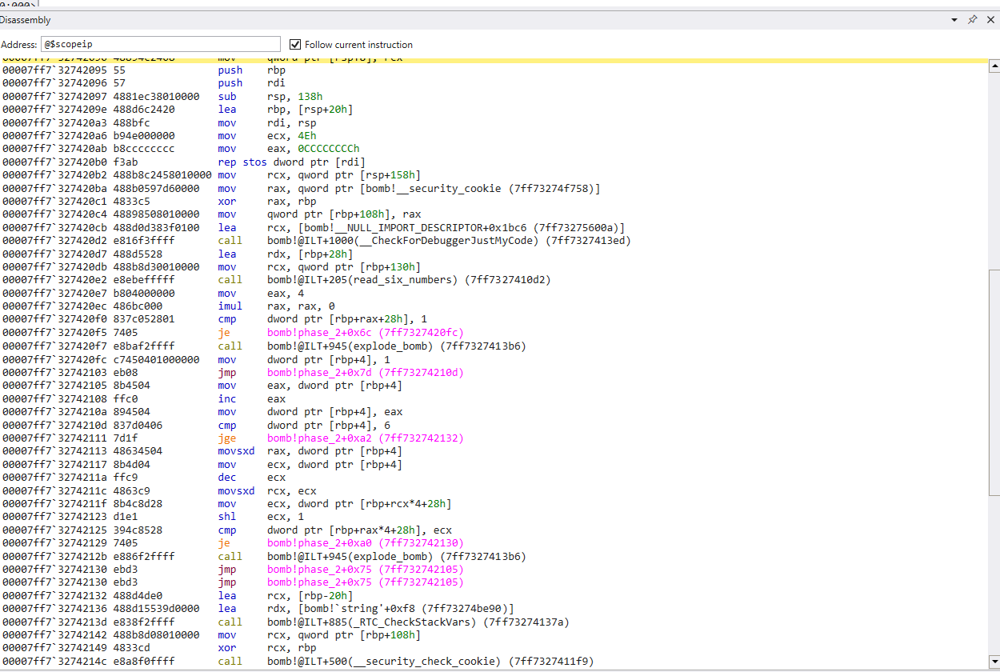
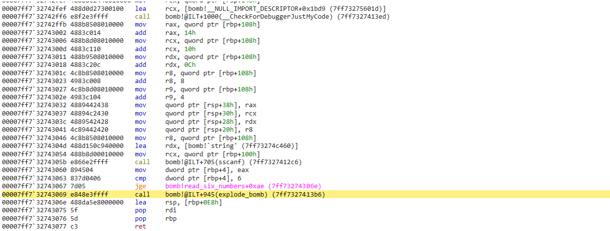
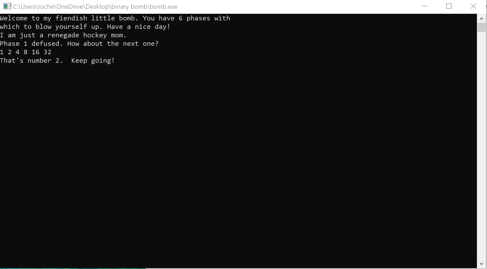

+++
title = "cmu binary bomb phase 2"
date = "2024-08-16T07:59:00-04:00"
draft = false
slug = "cmu-binary-bomb-phase-2"
categories = ["cmu-binary-bomb"]
featured_image = "img/computer.jpg"
+++

<!--more-->

Upon stepping into the ```phase_2()``` function, we see the initial register saves, stack allocation, what appears to be some base pointer linking, along with some other familiar instructions. 


_phase_2_

After the boilerplate code we have a function call to a new function
- `read_six_numbers`
We can safely assume this function probably does what it says it does, but does it serve any other purpose? To find out, let's take a look at the assembly code


_read_six_numbers_

Looking at the only ``` cmp``` instruction in `read_six_numbers()`, it looks like we are comparing the value from eax (moved to memory) with 6, and jumping over the `explode_bomb`() function if it is greater than or equal to. We can make an inference that this is what the code does, but what's with all of the instructions? The surplus of ```add``` and ```mov``` makes me think those may be red herrings designed to waste our time. 

Just before the call to ```sscanf()```, we can see a string loaded to ```rdx``` and a pointer loaded to ```rcx```.  Based on  Microsoft calling convention, I will assume ```rcx``` contains a pointer to our input, and ```rdx``` contains a format string, such as "%d".


_look at top window_

Here we can confirm that our six numbers are being passed as a parameter to the function. Now let's confirm the function is designed to *verify* we have passed in at least 6 digits. 

To confirm this is all ```read_six_strings()``` does, let's try passing in less than 6 numbers and observe what happens.


_jump not taken_


_boom_

Our inference seems to be correct. So we know we have to pass in 6 numbers for our input, but what six numbers? To find out, we will have to take a closer look at ```phase_2()```.
Once we are past our input validation function, we see a few other interesting pieces of code
- We see a series of jumps and compares throughout the function
- We also see several calls to explode_bomb function.

So we know have to pass in 6 integers to survive the ```read_six_numbers()```, let's see what happens if we pass in `1 2 3 4 5 6`.

Here is another view of the ```phase_2()``` function.


_phase_2()_

Just after the call to ```read_six_numbers()```, we have this series of instructions

```c
mov eax, 4
imul rax, rax, 0 //this zeros the register
cmp dword ptr [rbp+rax+28h], 1
```

If there is one pattern I've caught on to, espeically with Microsoft compiler, is that ```imul``` is often used to index some sort of array (or other structure). Earlier in the walk through we checked the values at [rbp+28h], and we confirmed that this was our input to be passed to ```read_six_numbers()```. Since ```rax``` is now == 0, we can see this is an obvious comparison between our first integer passed and 1. Just below we have 

```c
je bomb! offset in func
call explode_bomb
```

If we do not take the jump we will explode. This confirms our first input should be 1 always.

Now what about the next 5 numbers?

```c
mov eax, dword ptr[rbp+4]
inc eax
mov dword ptr[rbp+4], eax
cmp dword ptr[rbp+4], 6
jge ...
```

The above appears to take a value from memory, increment it, store it back in memory, and compare that with 6. This could be some control flow structure,  maybe a for loop or while loop going to 6. 

Next we see

```c
movsxd rax, dword ptr[rbp+4]
mov ecx, dword ptr[rbp+4]
dec ecx
movsxd rcx, ecx
mov ecx, dword ptr[rbp+rcx*4+28h]
shl ecx, 1
cmp dword ptr[rbp+rax*4+28h]
je ...
call explode_bomb
```

To sum this up, it looks like we take the value (possibly a counter) that we used in the previous comparison and move it into ```rax``` and ```ecx```. ```ecx``` is decremented and moved with sign extension to ```rcx```. It looks like we then access our input, but this time use `rcx x 4` as the offset into the input. We then bitwise shift left, which is the equivalent of multiply by 2. Finally, we compare another value in our input 'array', but this time use `rax x 4` as the offset into the input. ```rax``` is equal to ```ecx``` - 1 prior to the shift. If these are not equal we will explode. We can confirm this by checking a register view of our input from the above example


_look at top right window_

This confirms that ```rcx``` is being compared with ```rax``` x 2

**The algorithm appears to be checking that (input[n-1]x2) == n, starting at input[1]**

If this is the case, the expected input should be 1 2 4 8 16 32. Let's give it a try. 


_success!_


_look at top right window_

We can see that when ```rax``` is 0x6, ```rcx``` is 0x20, which is 32 decimal. ```rax``` was incremented again before our counter was compared with 6, so when it is 0x5, ```rcx``` is 32, therefore it certainly comparing input[n-1]x2 with input[n]. 


On to phase 3!

