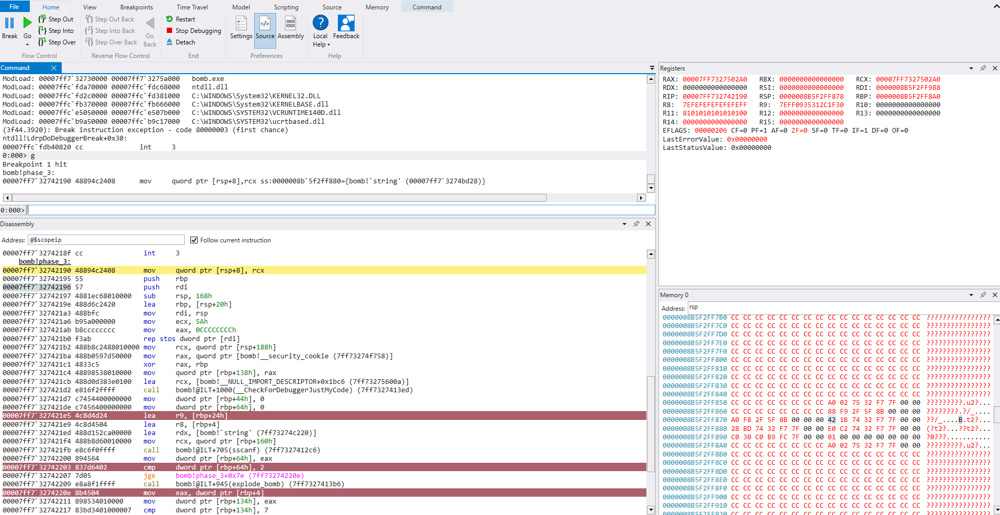
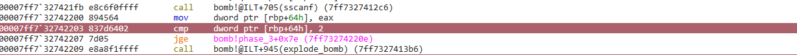
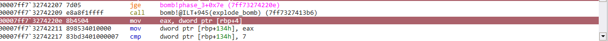
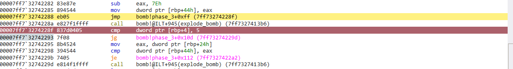
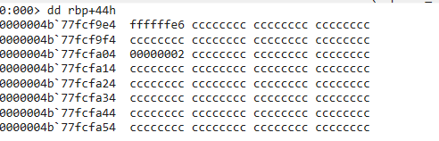
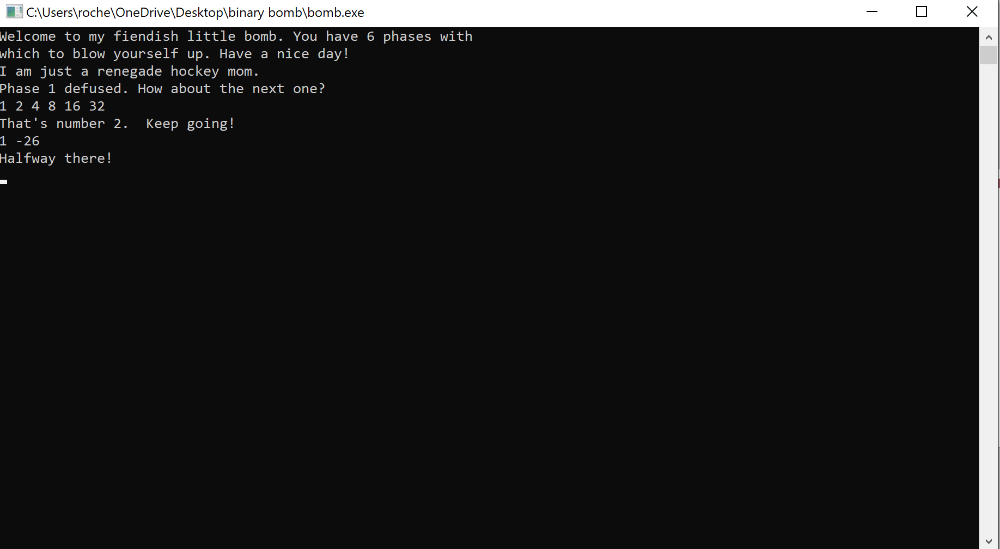

+++
title = "cmu binary bomb phase 3"
date = "2024-08-16T15:16:00-04:00"
draft = false
categories = ["cmu-binary-bomb"]
tags = ["reverse-engineering"]
+++

<!--more-->


_1/2_

_2/2_

Right off the bat we can see our boilerplate instructions and just ignore those. They stress us out for no reason. 

We also see a function call to 
- ```sscanf()```
- ```explode_bomb()```


```sscanf()``` is used to extract data from strings, and looking at it's [prototype](https://www.tutorialspoint.com/c_standard_library/c_function_sscanf.htm), we can see it takes at least 2 parameters. 
- First is the char pointer to our input
- The second should be the format of the data we are attempting to extract.

To find out what kind of data ```phase_3()``` wants, let's take a look at the parameters being passed to ```sscanf()```


This function is expecting two numbers. Great, let's continue stepping through. 

It looks like the return value of ```sscanf()``` is moved to memory and then compared with 2. If it is not 'greater than or equal', we are going to explode


This confirms we must pass in 2 numbers for this challenge.

After jumping over the first call to ```explode_bomb()```, there is a value loaded from [rbp+4] being compared with 7. This is our first input being compared with 7, and if it is 'above', we will take a jump to a call to ```explode_bomb()```

We can observe this here


Thus we can infer our first input should be no greater than 7. 

Continuing through the code, we see yet another comparison between [rbp+4], 5. This time we will take a jump to another call to ```explode_bomb()``` if our input is greater than 5. 



Once we survive this cmp/jump, we come accross one last comparison in this function 


```c
mov eax, dword ptr [rbp+24h]
cmp dword ptr [rbp+44h], eax
je ... which skips the call to explode_bomb()
```

Printing the memory at [rbp+24h], we can observe our second input stored in memory. Printing [rbp+44h], we can see the expected number



If we haven't made a mistake along the way, it looks like our first number can be 0-5, and our second input must be '0xffffffe6', which equates to -26 in it's signed twos complement form. 

Let's pass in 1 and '0xffffffe6' and see what happens


_top right window_

Viewing the registers window in the top right, we can see EAX successfully has the value the phase is expecting. 


_success!_

On to phase 4!
