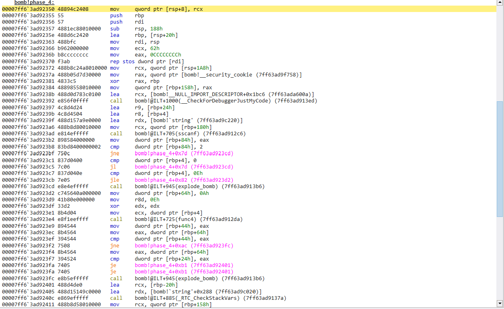
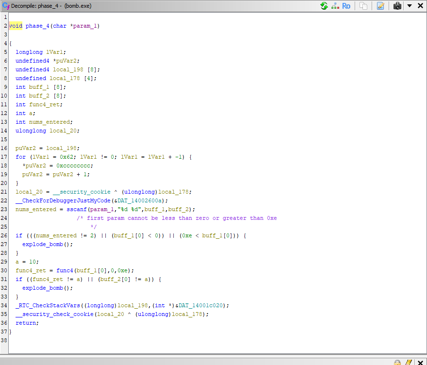
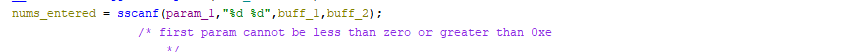
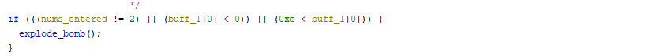
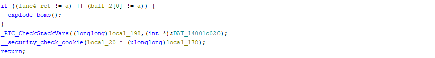
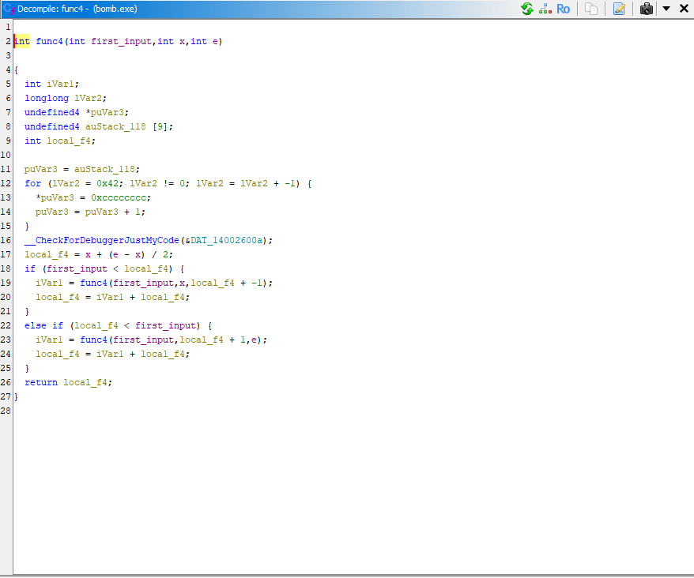
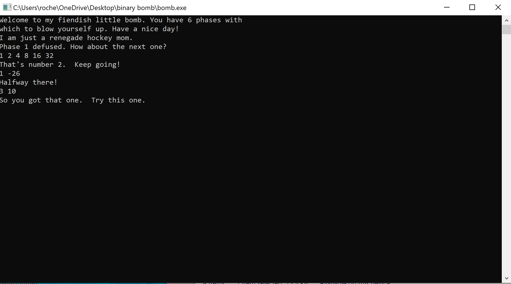

+++
title = "cmu binary bomb phase 4"
date = "2024-08-16T23:27:00-04:00"
draft = false
categories = ["cmu-binary-bomb"]
tags = ["reverse-engineering"]
+++
<!--more-->

### Phase 4!

Here is a view of the ```phase_4()``` assembly code



For this phase, I decided to break out the reliable red dragon. Let's throw this into Ghidra and start inspecting the this function.

*Note: I did step through the decompiled code and change some variable names and add comments for readability purposes*

```phase_4()``` in Ghidra



First we are passing ```sscanf()``` pointer to our input, followed by our format string, followed by two buffers to store the extracted integers. 


_sscanf view in ghidra_

Looking at our first 'if' statement, there is 3 separate checks, any of which will result in an explosion. These are
- nums_entered != 2
- buff_1[0] < 0
- 0xe < buff_1[0]



Based on the constraints, we must pass in 2 integers, our first input cannot be less than zero or greater than e (14).

Seems easy enough. Here comes the fun.

Just before the second 'if' statement, we have a few declarations

```c
a = 10;
func4_ret = func4(buff_1[0], 0, 0xe);
```

Followed by the second 'if' in ```phase_4()``` which checks that
- func4_ret != a
- buff_2[0] != a



According to the second set of constraints,  both ```func4_ret``` and buff_2[0] must == 10. This seems pretty straightforward, we just need  to ensure that ```func4_ret``` == 10

The first call to `func4()` is here

```c
func4_ret = func4(buff_1[0], 0, 0xe);
```
The parameters are

- First integer we input to the program
- second is zero
- third is E (14)

Let's take a look into ```func4()``` to see how to get the return value we want



We assign a local variable before proceeding with the 'if-else'
```c
local_f4 = x + (e-x)/2
```

If we evaluate this using the parameters passed first, we get
```c
local_f4 = 0 +(14-0)/2 == 7
```

Next we have the conditional statement

```c
if (first_input < local_f4) {
	iVarl = func4(first_input, x, local_f4 + -1);
	local_f4 = iVarl+local_f4;
} else if (local_f4 < first_input) {
	iVarl = func4(first_input, local_f4+1, e);
	local_f4 = iVarl+local_f4;
}
```

which will always check if our input is greater than or less than ```local_f4``` on the first pass through. As you probably noticed, this function makes recursive calls to itself in either case we take. 

To cut straight to it, ```local_f4``` will always be 7 on the first pass, and we need to return from this function with the value 10, meaning we need a recursive call that will result in a return value of 3.

I will unashamedly admit this took me a while tracing through recursive calls by hand, but if we pass in an initial value of **3** we can trigger this by:

*(I will plug in values rather than variables for readability)*

```c
local_f4 = 0 + (14-0)/2 == 7
if (3 < 7) {
	iVarl = func4(3, x, 6);
	local_f4 = 7+iVarl
}
```
This first call is ready to return 7, but it is waiting for the recursive branches to return. Here is the recursive call step-through

```c
local_f4 = 0 + (6-0)/2 == 3
if (3<3){
...
} else if (3<3){
...
}
//input and local_f4 are equal, so we skip both conditionals
return local_f4
```

Which will ultimately result in us returning back to ```phase_4()```
with the value of 10 just as we needed.

Looking back at our last conditional statement,


Since a == 10, we can see above that our input of '3 10' should successfully avoid all of the 'code mines', if you will. 

Let's give it a shot



On to phase 5!