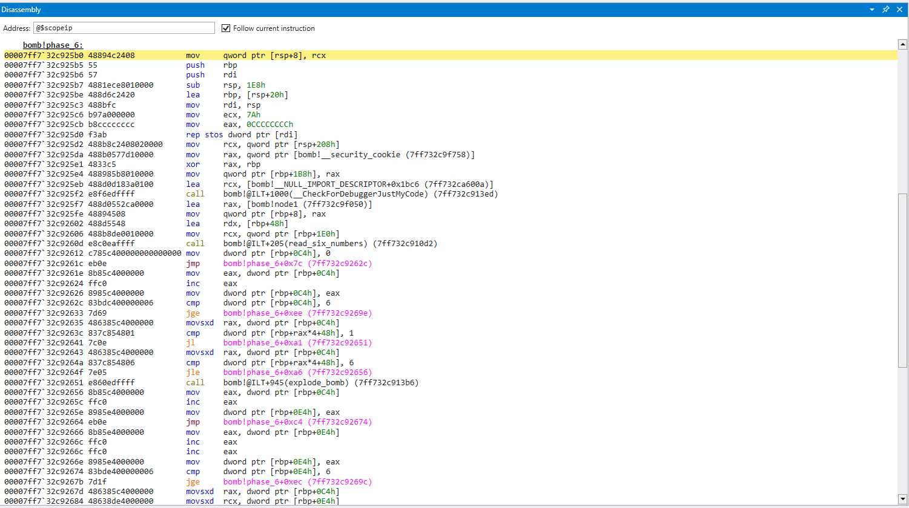
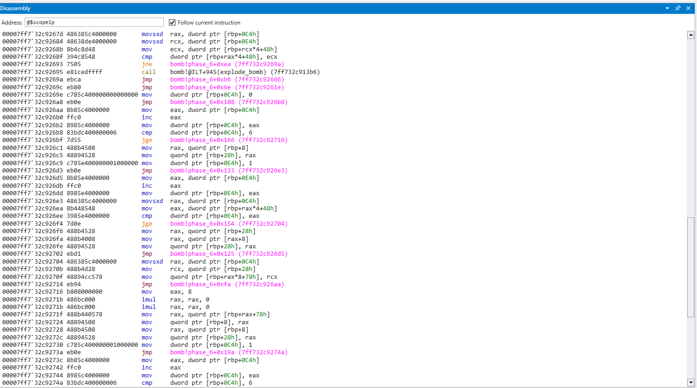
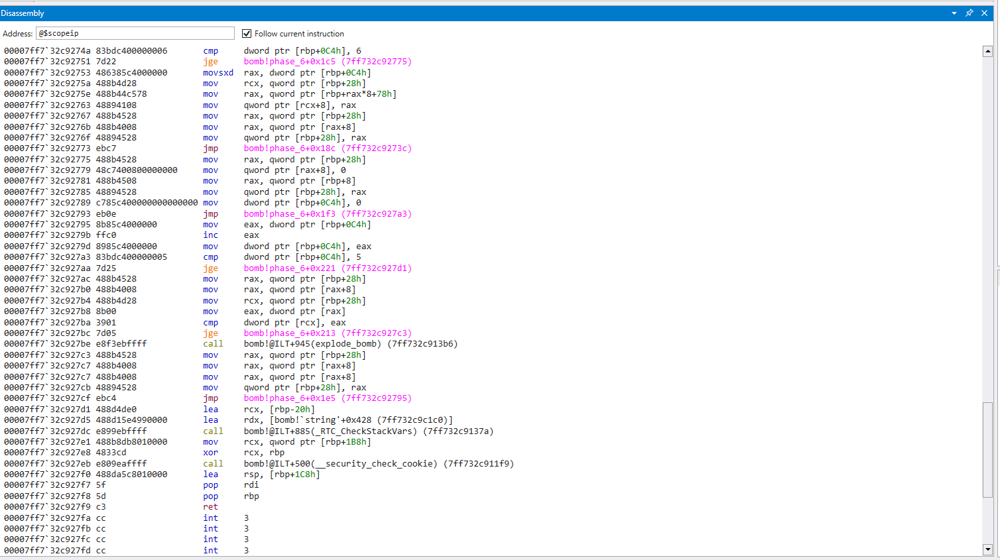
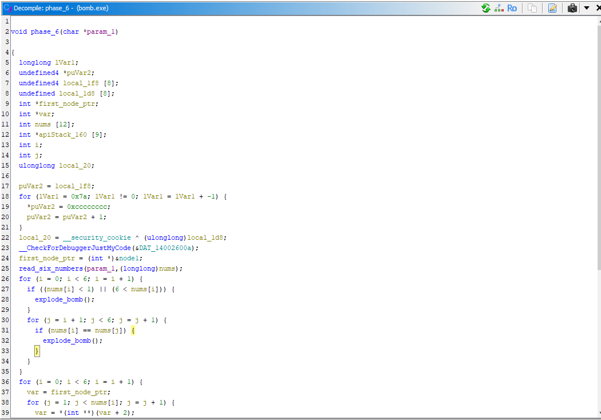
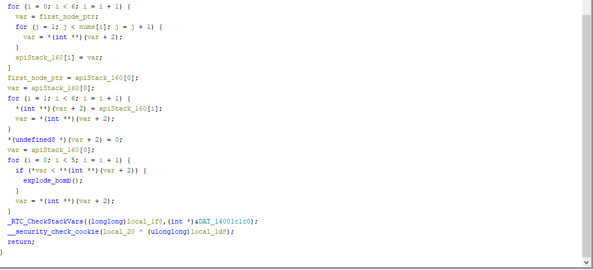
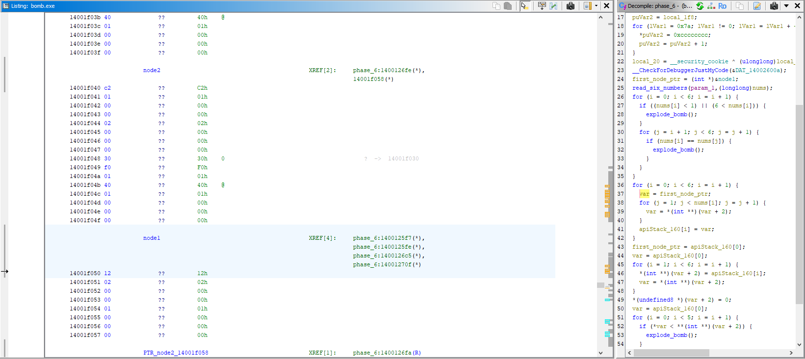
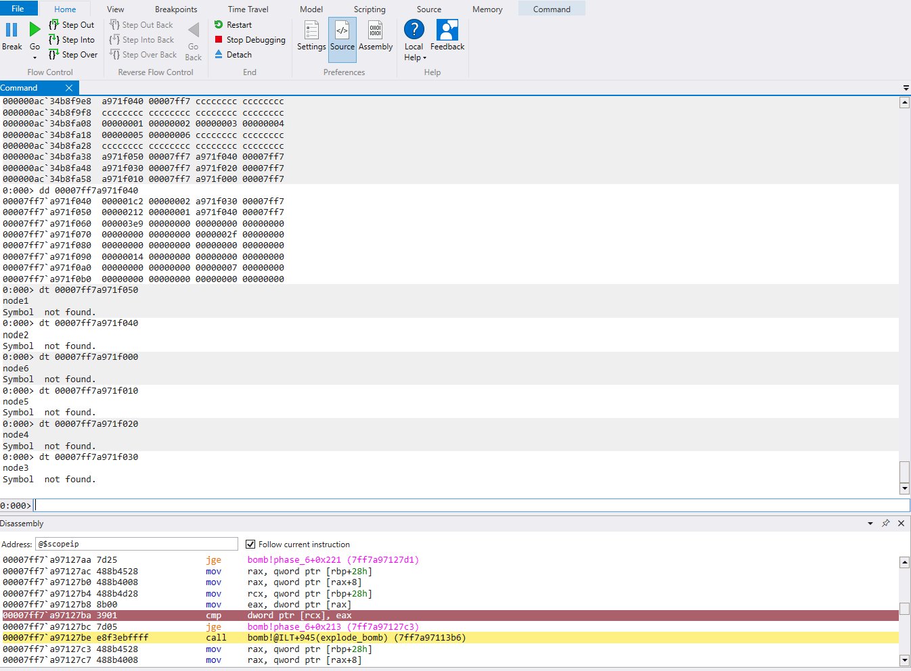
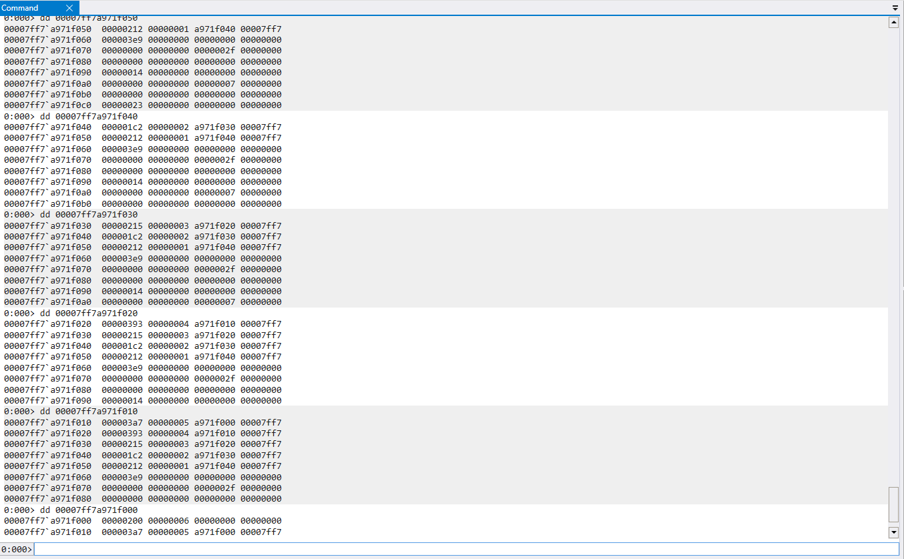
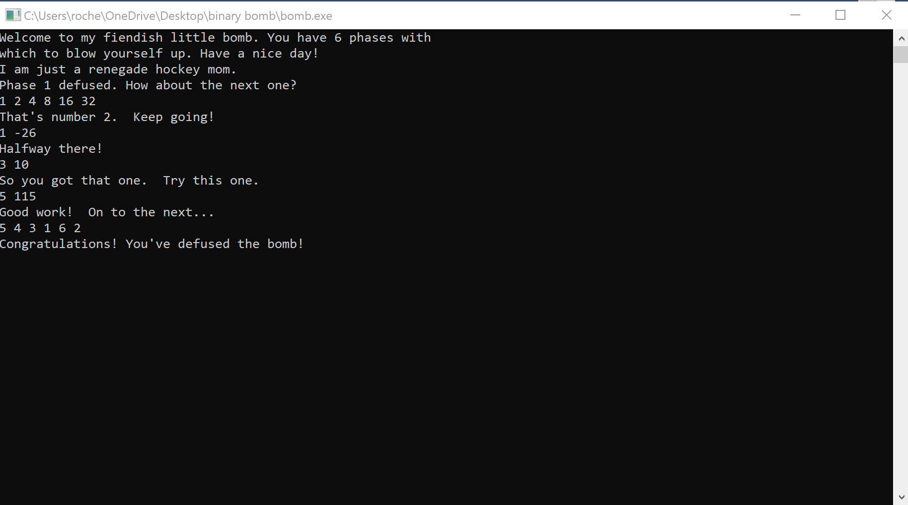

+++
title = "cmu binary bomb phase 6"
date = "2024-08-19T23:27:00-04:00"
draft = false
categories = ["cmu-binary-bomb"]
tags = ["reverse-engineering"]
+++
<!--more-->

### Phase 6

We've made it to ```phase_6()```. It hasn't been easy, but we are here, suited up, ready to defuse the final bomb (hopefully). 

If you noticed my 'hopfully' at the end of the last walk through, it's because I ran a string search on the `bomb.exe`, and I saw something alarming. It was something like `"You've found the secret phase!"`, which has been lingering in my mind ever since I found it. I've seen no other evidence of a 'secret phase'. Probably a skill issue. We'll see if it comes back to haunt us anywhere in this walk through.

Let's begin





I only see two function calls in this phase
- `read_six_numbers()`
- `explode_bomb()`

and based on our previous encounter with `read_six_numbers()`, it's safe to say that this phase wants a specific sequence of 6 numbers

After  the call to `read_six_numbers()`, we have a series of what appears to be loops. 

Let's open this up in Ghidra and take a closer look at the code




Getting straight into it, I see a for loop with a nested for loop
```c
for (i = 0; i < 6; i++) {
	if ((nums[i] < 1) || (nums[i] > 6)) {
		explode_bomb();
	}
	for (j = i + 1; j < 6; j++) {
		if (nums[i] == nums[j]){
			explode_bomb()
		}
	}
}
```

Here are the two conditions to pass the first check
- Our input must be [1, 6]
- We cannot have any repeating digits in our input

This makes the challenge a bit easier since we are restricted to only numbers [1, 6], and they are all only used once

It gets interesting once we arrive at the next sequence of for loops

If you didn't spot it above, just before our call to `read_six_nums()`, we have this declaration
```c
first_node_ptr = (int*)&node1;
```

It appears to be a pointer to a node, but what kind of node? 



This appears to be a linked list with 6 nodes in it, which would explain the gnarly pointer notation used in the for loops below


There is a lot going on here, but there is only one compare that leads to an explosion

```c
if (*var < **(int**)(var+2)) {
	explode_bomb();
}
```

Which appears to be iterating from 0-5, comparing the dereferenced value of node **n > n+1**, and calling `explode_bomb()` if not true.

We are going to assume our input has some impact on these nodes, otherwise how else can we possibly control if `node1 > node2` if we *always* start with `node1` and cannot change the values?

To understand the structure of these nodes, let's use WinDbg to take a closer look at the memory 

WinDbg has a function `dt <structure> <addr>` that can potentially display the breakdown of a structure such as a node, but it was not working for this. It did, however, confirm the addresses in which `node1`-`node6` reside



If we dump the memory at these addresses, we can view breakdown of `node1`-`node6`



Based on this, we can easily see the structure of each node
`<value> <node number> <memory address>`

`Node 1: 0x212`
`Node 2: 0x1c2`
`Node 3: 0x215`
`Node 4: 0x393`
`Node 5: 0x3a7`
`Node 6: 0x200`

If the goal is for `node` n > n+1 for all nodes in the list, we need to order the nodes in descending order, which would be

`Node5` > `Node4` > `Node3` > `Node1` > `Node6` > `Node2`

Seeing that the node numbers are [1,6] and do not repeat, this is most likely our password



We did it! There was obviously *alot* more work that went into solving this challenge, but I hope I made it at least halfway enjoyable to read/walk through.

Until next time...