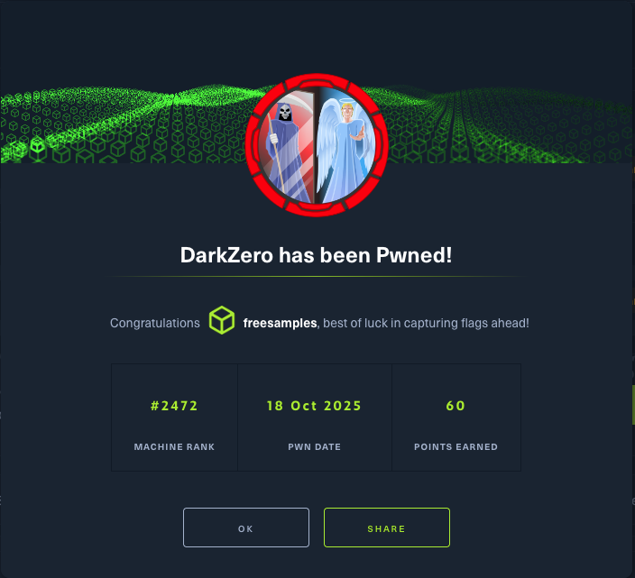

+++
title = "htb season 9 - darkzero"
date = "2025-10-13T23:32:00-04:00"
draft = false
categories = ["hackthebox"]
tags = ["season9","windows","active-directory"]
+++

<!--more-->
## Box Information

| Box Name | Signed |
|----------|------------|
| OS | Windows |
| Difficulty | Hard |
| Release Date | 2025-10-3 |
| Retired Date | YYYY-MM-DD |

## Introduction

DarkZero is the second box of HackTheBox Season 9. It is a Hard difficulty Windows box that... is still active. Will post the writeup once the box is retired :)

