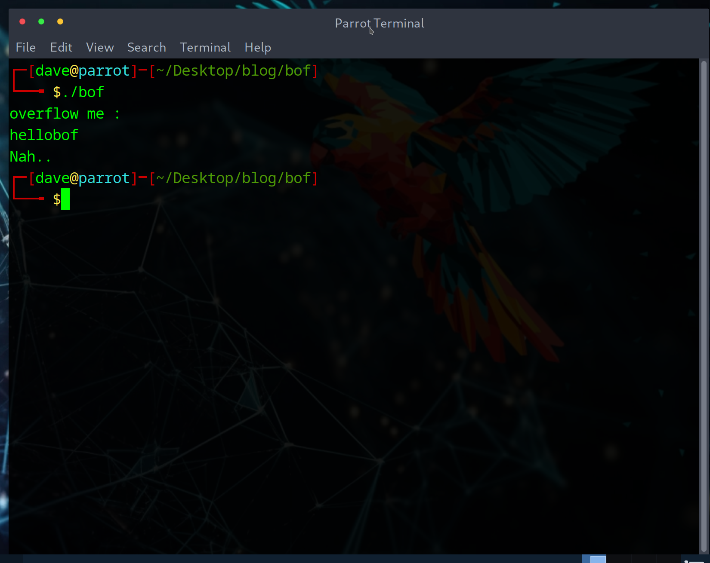
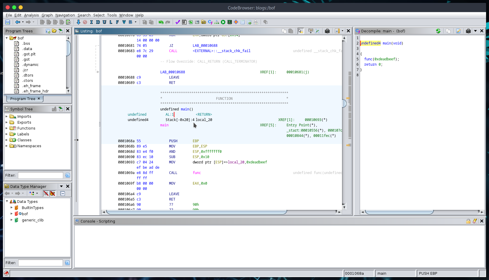
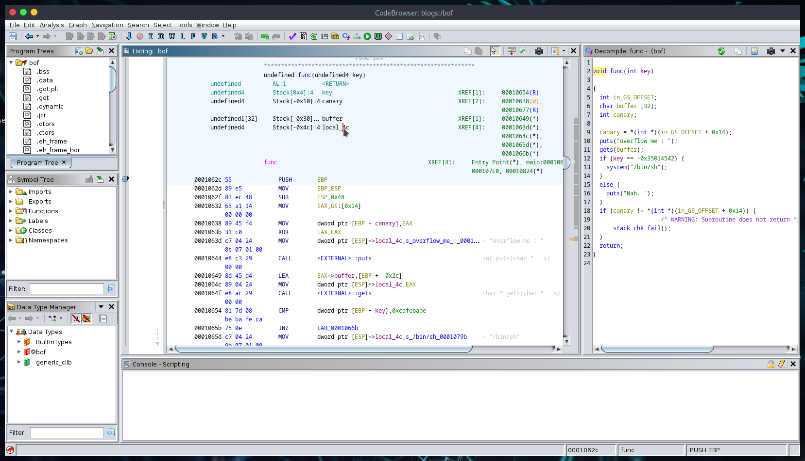
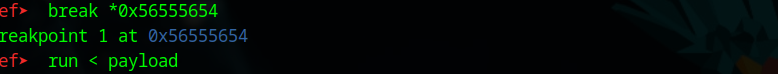
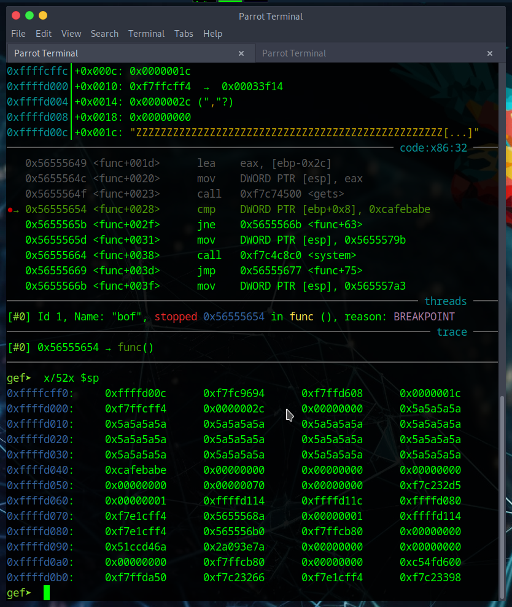

+++
title = "Want to overflow buffers?"
date = "2024-08-09T23:32:00-04:00"
draft = false
categories = ["pwnable"]
featured_image = "img/buff_ovf.svg"
+++


<!--more-->

## Introduction

This writeup will include a comprehensive walkthrough of the 'bof' room from the Toddler's Bottle section on pwnable. If you don't know about pwnable, it is a wargame site that hosts a collection of challenges regarding system exploitation. Check it out here -->  [pwnable.kr](https://pwnable.kr) 

If you are here and have no clue what a buffer overflow is, my goal is to give you a good enough understanding of what it is and how it is exploited so that you can recreate it in your own environment. 

There are no direct prerequisites to this challenge, but a basic understanding of CPU architecture and assembly language will make your life easier. Here are two fantastic rooms from  [TryHackMe](https://tryhackme.com/dashboard) that cover these:
- [x86 arch overview](https://tryhackme.com/r/room/x8664arch)
- [x86 assembly crash course](https://tryhackme.com/r/room/x86assemblycrashcourse)

## Challenge

**'Nana told me that buffer overflow is one of the most common software vulnerability.**  **Is that true?'**

This is the only tip we are given for the 'bof' room description.

We are given links to the source code (bof.c) and executable (bof), as well as the netcat command to get the flag once we solve this puzzle. 

Let's begin.

## Walkthrough

Once you download the source code and executable, it's always a good idea to run it just to get an idea of how to approach the puzzle. 


<br>

So the executable prints 'overflow me :' and takes our input. Let's take a look at the source code:

```c
#include <stdio.h>
#include <string.h>
#include <stdlib.h>
void func(int key){
	char overflowme[32];
	printf("overflow me : ");
	gets(overflowme);	// smash me!
	if(key == 0xcafebabe){
		system("/bin/sh");
	}
	else{
		printf("Nah..\n");
	}
}
int main(int argc, char* argv[]){
	func(0xdeadbeef);
	return 0;
}

```

Let's break this down to get a good idea of what's going on how we can solve this room:

```c
int main(int argc, char* argv[]){
	func(0xdeadbeef);
	return 0;
}
```
We have a standard C `main()` function that isn't too exciting. We call `func()`  passing '0xdeadbeef' as a parameter, and then return 0. Let's have a look at `func()`

```c
void func(int key){
	char overflowme[32];
	printf("overflow me : ");
	gets(overflowme);	// smash me!
	if(key == 0xcafebabe){
		system("/bin/sh");
	}
	else{
		printf("Nah..\n");
	}
}
```

`func()` breakdown:
- we can see this function takes in a single key as a parameter. 
- we also have a buffer 'overflowme' that has space for 32 characters
- prints a message 'overflow me :'
- call `gets()` to read into our buffer

<br>
##### Note on `gets()`
 Incase you don't already know, `gets()` is inherently vulnerable due to it's lack of bounds checking. It reads a line from 'stdin' and stores it in the buffer, but does not perform any checks to ensure the input fits within our allocated buffer. Running across it in the wild is probably unlikely, since most developers know this (and compilers will scream at you if you attempt to use it), but it's great practice for overrunning buffers. 

When developing your own software, it is strongly encouraged (almost forced unless you just ignore the compiler's screams) to use `fgets()`, which reads a string from a file or input stream while allowing you to specify the number of bytes to read. This helps us better manage buffers and try to avoid vulnerabilities like the one we are exploiting today

Here is a geeksforgeeks article that goes over both of these functions --> [gets and fgets](https://www.geeksforgeeks.org/fgets-gets-c-language/)

Finally, we have a comparison between our 'key' and '0xcafebabe',

```c
if(key == 0xcafebabe){
		system("/bin/sh");
	}
	else{
		printf("Nah..\n");
	}
```

which will yield us a shell if they are a match.

Now that we have an idea of whats going on, we can clearly see the goal. `func()` is called with the key '0xdeadbeef', but we need key to evaluate == to '0xcafebabe'. Let's take a look at the structure of the file to get an idea of how we can make this happen. 

### Analyzing the file
To do this, we will use [Ghidra](https://ghidra-sre.org/). If you aren't familiar with this tool, it is a software reverse engineering tool developed by the NSA.  Ghidra provides a suite of features for analyzing compiled code, including a disassembler, decompiler, and various debugging capabilities. It can be a bit overwhelming initially, but familiarizing yourself with some of it's features can be a huge help for future challenges like this one. 

Here we have a disassembled view of the `main()` function in Ghidra:

_main function_


This isn't too useful for what we are trying to accomplish, but `main()` is typically where we would begin our analysis. The goal of overwriting 'buffer' into 'key' seems clear, but we need to take a closer look at `func()` to get an idea of how the variables are stored on the stack (or somewhere else). 

Here we have a disassembled view of `func()`: 

_func function_


*I am going off the notion that whoever has made it this far has some x86 assembly knowlege, so I will refrain from walking through the instructions.*

The information at the top tells us how these variables are organized at runtime. We can see here: 

_func() stack layout_

We have several variables stored on the functions stack, including key, buffer, and a variable we did not see in the source code, 'canary'. I will save the details of stack canaries for another writeup I am in the process of doing, but to quickly summarize it:

- A stack canary is a security mechanism automatically inserted by the compiler to detect and/or stop buffer overflow attacks. This involves placing a small, random value (canary) between the stack buffer and control data (return address of the function most of the time). 


_Since the stack canary check is at the bottom of the function (after the if-else), we don't need to worry about it as we will get a shell before it is reached during execution_


Taking a closer look at how the variables are organized, we can see 'key' will be stored at Stack[0x4], and buffer will be stored at Stack[-0x30]

_stack layout up close_

To translate, 'key' is stored 4 bytes above EBP and buffer is stored 48 bytes below EBP. If we want to go from 'buffer' to the beginning of key, we would need to overwrite 48+4 bytes. Let's confirm this by opening this in GDB and seeing where our input lands. 


### Using GDB to take a closer look
*I will also be using 'gef', otherwise known as 'GDB Enhanced Features', which gives us a bit more information and more debugging features than the standard. [Here](https://github.com/hugsy/gef) is the link if interested*

Let's start by creating a payload of 52 characters and passsing it as input:


_input passed to program_

We can then examine the memory to see if our input is stored as expected:

_Note: 'Z' has an ASCII value of '5a'_

Just as expected, we can see where our input starts and where it ends. We need to finish crafting the paylaod with our expected '0xcafebabe' appended to the Zs. This should yield us a 'true' comparison in the `func()`, giving us our shell and hopefully a flag. 

Since our data is stored in little endian format, we need to be careful when crafting this to be sure the bytes are stored correctly.


_craft payload using python_

We can then run the program in GDB again, but this time pass our new payload as the input


_passing payload_

And then re-examine the memory to see if our attempt was successful


_examine memory_

**Success!** 

We can see that we successfully overwrote the memory address that previously contained '0xdeadbeef' to now store '0xcafebabe'. All that is left to do now is run this with the netcat command we were given and retreive our flag. 


_shell given_

I redacted the flag from the photo to hopefully encourage others to try this exploit out themselves. 

### Summary
If you made it here, congratulations. This challenge, while not extremely tricky, took several steps to complete. We started with analyzing the binary file, examining the stack layout using Ghidra, and examining our input in memory using GDB before finally crafting our payload. I sincerely hope you enjoyed working through this room with me. 

Stay tuned for more pwnable rooms! :D