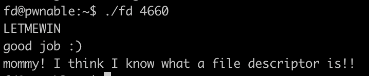

+++ 
title = "Introducing myself and file descriptors"
date = "2024-08-04T14:00:00-04:00"
draft = false
categories = ["pwnable"]
featured_image = "img/file_desc.jpg"
+++

<!--more-->

<div class="prompt-warning">
  <strong>This is a warning:</strong> I have never blogged before. Have mercy on me.
</div>

## **Introduction** 
Hello, my name is David. I am a senior Computer Science student who, like most who will probably read this, spend way too much time on computers. I have found myself increasingly interested in research and take way too many notes to not have somewhere to share them with the world. I think it's time to create somewhere to talk about these things that excite me with hopes that they will excite you, too. Enough about me, but if you'd like to connect, feel free to add me on LinkedIn. Today I am going to do a writeup on a fairly easy room from [pwnable](https://pwnable.kr). I did this room toward the beginning of this summer and I personally really enjoyed the bite (or byte) sized challenge it offered. Without further ado,

### **Challenge Description**
This walkthrough is for the 'fd' challenge under the Toddler's Bottle section on pwnable. This room is designed to be a perfect introduction (or refresher) to file descriptors in Linux. In a nutshell, a file descriptor is a small, unsigned integer that uniquely identifies an open file within a process. As you probably know, everything in Linux is treated as a file, including our beloved stdin and stdout. 

**'Mommy! what is a file descriptor in Linux?'**

This is the only tip we are given from the 'fd' writeup and description aside from the ssh login. I somehow simultaneously love and hate the tips left behind for us with these rooms. Peak trolling.

Upon logging onto the machine, you'll get the binary and the .c file. Here is the source code for this challenge:

```c
#include <stdio.h>
#include <stdlib.h>
#include <string.h>
char buf[32];
int main(int argc, char* argv[], char* envp[]){
	if(argc<2){
		printf("pass argv[1] a number\n");
		return 0;
	}
	int fd = atoi( argv[1] ) - 0x1234;
	int len = 0;
	len = read(fd, buf, 32);
	if(!strcmp("LETMEWIN\n", buf)){
		printf("good job :)\n");
		system("/bin/cat flag");
		exit(0);
	}
	printf("learn about Linux file IO\n");
	return 0;

}
```

After a quick glance at the main function, we can see a check for a command line argument. The program is expecting a number that will be used for this calculation:

```c
int fd = atoi( argv[1] ) - 0x1234;
```

atoi() will convert ASCII to integer in the case we do not pass in a number, subtract 0x1234 from the value and store in our variable fd. Further down we see fd being used in this line:

```c
len = read(fd, buf, 32);
```

The read() function is a system call in the standard C library. A quick description is that read() attempts to read up to count bytes from file descriptor fd into the buffer starting at buf.

More information on read() can be found [here](https://www.man7.org/linux/man-pages/man2/read.2.html)

Consequently, we have a conditional that compares our buf with LETMEWIN\n:

```c
if(!strcmp("LETMEWIN\n", buf)){
		printf("good job :)\n");
		system("/bin/cat flag");
		exit(0);
}
```

and only when they are equal can we retrieve the flag.

Alright, easy enough. We are going to read from file descriptor fd into buf for count number of bytes. But how do we know which file contains our LETMEWIN\n value?

Well, a quick google search reminds us that there are three standard file descriptors in Linux:

    Standard Input (stdin) : 0

    Standard Output (stdout) : 1

    Standard Error (stderr) : 2

You probably already see where this is going...
Solution

You see, since fd is assigned a value of our choice - 0x1234:

```c
int fd = atoi( argv[1] ) - 0x1234;
```

We essentially have control over the file descriptor used to read data into buf. Passing 4660 (0x1234 in decimal) as our cmd line arg allows read() to look at stdin for the data to store in buf, so we can easily make our conditional true by typing LETMEWIN.



### Summary

This is a beginner friendly room that reminds us of why file descriptors are important in Linux. Stay tuned for more pwnable challenges that will make you want to rip your hair out.
